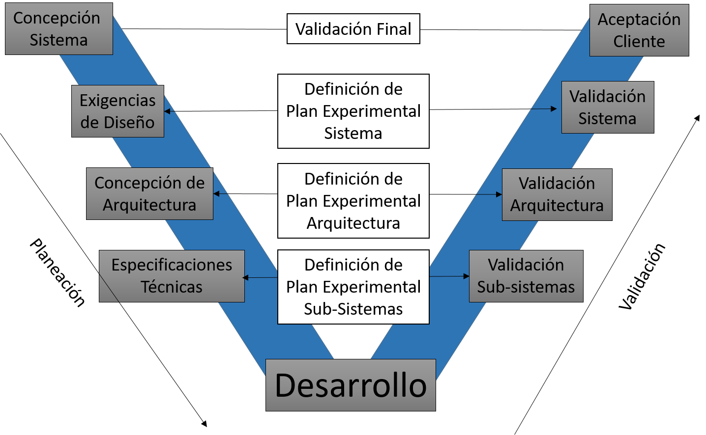

# Visualización
## o
### qué
#### paper

*Así se ponen itálicas we*

__Y así negrillas__

~~NO~~ *__se pueden ambas__*

Líneas

---

Listas
1. You
2. Name
..1. Wopa  
3. It
* Or
* Not

[La página de la empresa más chingona](www.rd-mex.com)



<hr>


`print("Hello Darkness my old friend")`

```python
print("I've come to talk to you again")
s= "Because a vision softly creeping"
a="Left its seeds" while "I was sleeping"
print(s)
print(a)
```

<dl>
    <a href="www.rd-mex.com">Hola</a>
</dl>
