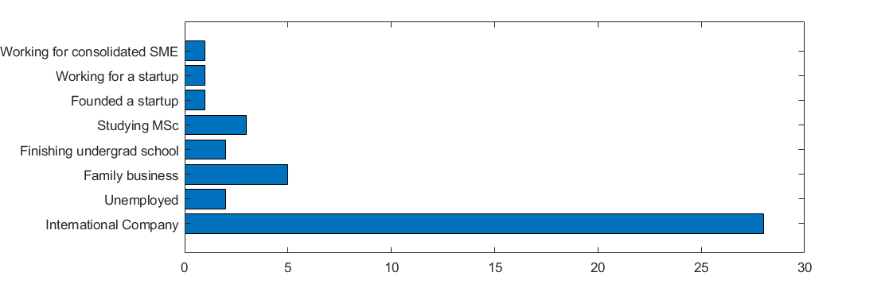
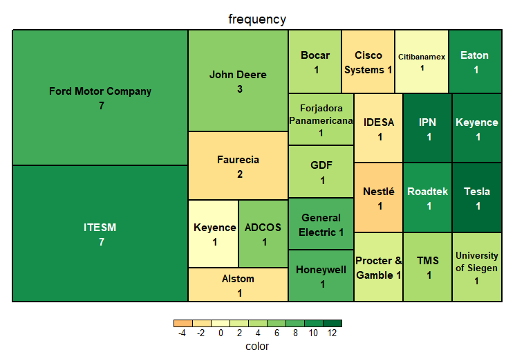
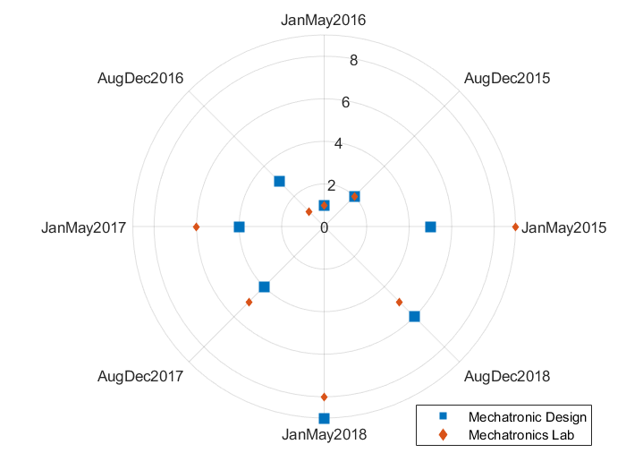
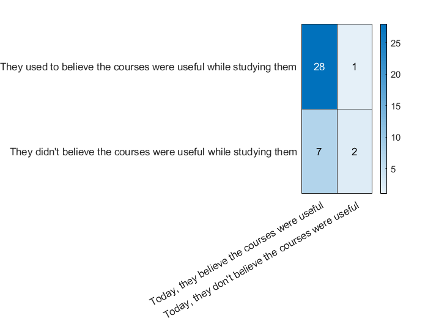

# Feedback on the Mechatronic Design and Mechatronics Lab courses

__What is your current occupation?__
39 replies given
*This question allowed for multiple responses

__Name of the company or university where you currently study/work?__
39 replies given

__You took the courses on:__
39 replies given

__Did you believe the courses were useful back then vs. your current opinion__
38 replies given

__Please indicate the job roles that are more similar to activities that you have carried out professionally in your short career__
37 replies given
*This question allowed for multiple responses

__Please select all tools that you have used in those roles:__
36 replies given
*This question allowed for multiple responses

__Please select all skills that you believe were developed or improved within the courses:__
36 replies given
*This question allowed for multiple responses

__What did you like the most about the courses?__
25 replies given

"I liked that what course material is the closest approach in our major to what we find in work life."

"The cases and examples seen in class, the constant dynamics of the professor, and the simple way in which the topics were presented."

"The team worked very well together, without any bad vibe."

"To learn everything that conforms a project, includding the planning, supply chain logistics, sales, etc… I found very interesting as it gives you a broader perspective."

"The focus on business."

"How it integrates all areas including administrative and technical."

"The integrated vision given to the projects that were developed."

"The applied project management methodology. The activities that developed soft skills (presenting, pitch, mechatronic design)."

"All the course content is of great interest."

"To get more detail into the planning and validation required for a project."

"The dynamics of the class, the challenge of presenting a project in english is something very important because everyday I have a 

meeting with people in the United States, which makes it a priority for me to speak a professional and technical English. The 

professor's availability and the explanations regarding how can Mechatronics be applied in a real job."

"The course content."

"The availability of the professor."

"The integration of the business model with the technological development. It takes us out of our Engineering "bubble" and gives us some notions in logistics, marketing, management, etc."

"The level of information was really precise and accurate to the latest industrial developments and designs. Long story short, I found it very useful."

"You learn about innovation and entrepeneurship from a mechatronics engineering perspective."

"Different topics from what we usually see in Mechatronics, examples and notes of current technology and global situations."

"What I liked the most was the dynamics of the class. It wasn't only about learning theory and memorizing, but rather looking into applied cases from our times and do something differently."

"I've used in industry most of what I've learned in those courses."

"While I didn't appreciate it when I had the courses, I now find them very useful. You get an overview of many topics not seen in other courses and that are deeply applied in my job life."

"The challenge of creating the design of a device in which you could apply the knowledge obtained through the major, as well as the development of all the steps to manufacture and distribute it."

"The focus given to start up a company."

"In my opinion, the different tools that are presented give a new vision different to the context we had about creating a new company."

"That the person who teaches it is somebody who actually applies all that he teaches. Moreover, the topics of the course are very important to complement the skills of an Engineer."

"The part about planning a business, from the business model concept to the production and manufacturing plans, and the financial analysis."

__Should the class go deeper into any subject? Or present something with less detail?__
23 replies given

"I consider that the content is adequate."

"Go deeper in the quality part, as they are very interesting topics that very few times are mentioned through the courses of the major."
"I believe you should take an approach into the individual progress instead of team progress. In this way, it would be easier to solve the questions and avoid delays or misunderstandings."

"I believe it was very complete for a semester."

"Less theory, or at least make it more dynamic."

"Deepen into the logistics process and plant design."

"Focus more in the development of real Engineering projects. To execute a project is really important, but without losing the focus on Engineering."

"It would be good to deepen into the industrial life (LO/TO, safety, processes, etc.)"

"I would have loved to be of any help to your startup or maybe carry out a project like PACE but with your startup."

"To get more detail into CAE, how to reach a minimum viable product."

"The class was always perfect."

"I keep on emphasizing on the Project Management and the methodology that involves it."

"Emphasis in the processes, inputs and outputs."

"No. They were my two favourite courses."

"I believe all together was useful."

"No, maybe add exercises/homework that help us practice the learnings from the class."

"There's a good balance."

"I know it's Mechatronic Design but you could separate those that are more interested in Mechanical Design and, as it's usual to require technical drawings of the project, ask them to reasearch (or give them a brief but deep explanation) about geometrical tolerances. Anyone who goes into part design will require that. DFMEA is also used a lot."

"I would have liked to deepen a little bit more about production lines."

"More about entrepreneurship, less about manufacturing."

"There were too many topics but I believe they were accurately distributed in the courses, even with the days off."

"Maybe deepen in the financial analysis, to validate if our business idea is feasible or not."

"Maybe in the marketing strategies as we know nothing and maybe take the modeling part away as you can use that time for more practical things."

__Do you think there is any subject that could be added to the class?__
21 replies given

"Maybe speak about the Lean philosophy within the companies."

"The part of continous improvement or innovative solutions."

"I would have liked that you somehow share your automatic process control knowledge in some way during the class, but due to the nature of the project, I don't see it always possible."

"I would have loved to see how to obtain funding to start and carry out a project."

"Make more exercises focused on sales, costs, etc."

"I don't think so."

"Project feasibility and suppliers' relationships."

"State of the art of the industry. Where can a Mechatronic Engineer work in Mexico."

"More methodologies or tips to implement a business idea."

"That the decisions about PACE project were more open. In another words, certain decisions made in relation to the smart vehicle were already defined and we had to research into how to develop the objective of somebody else. It is obvious that somebody must be the face of the project, but we lacked a leader (among the students) that cared about the opinions of the other students."

"Deepen more in the topics, since the project itself took out some time."

"The courses were reviewed accordingly to the work plan."

"Creative thinking focused into problem solving. Show how any idea can work as long as there is time and money."

"No."

"More realistic scenarios."

"The geometric tolerances."

"No, I believe the course content was really complete."

"Cloud services and mega trends."

"To be honest, I don't know. However, many different and interesting topics were seen. This gives you context of what lies behind a product, and is a very good simulation of entrepreneurship subjects."

"A real example of any product. From it's conception towards it's death."

"No."

